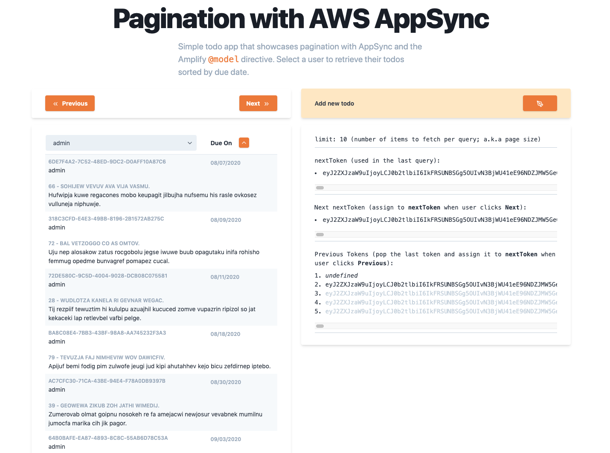

# Simple Pagination App with AWS AppSync

Simple project to help you get started with pagination using AWS AppSync

See the dev post for more info: [Implementing pagination with AWS AppSync](.)

🛠 Built with React, GraphQL, AWS Amplify, & AWS AppSync

Check out a read-only version here: https://master.d3k18ga236kzj2.amplifyapp.com/



## Deploy directly with Amplify Console

[](https://console.aws.amazon.com/amplify/home#/deploy?repo=https://github.com/onlybakam/todo-app-pagination)

## Deploy backend and run locally with the CLI

1. Clone the app
  
```sh
git clone https://github.com/onlybakam/todo-app-pagination.git
cd todo-app-pagination
yarn
```

2. Initialize the Amplify app

```sh
amplify init # follow the prompts
```

3. Push to the could

```sh
amplify push # follow the prompts
```

4. Start the server

```sh
yarn start
```

## Pre-populate the app (optional)

Run the "loadTodos" Lambda function to pre-populate 250 todos across 3 default users.

1. open the amplify console
```sh
amplify console # opens the amplify console in your browser
```

2. click "View in Lambda" to open up your function in the Lambda console.
3. Create a new test event using the "hello-world" template. The content of the event is not important.
4. Click "Test"
  